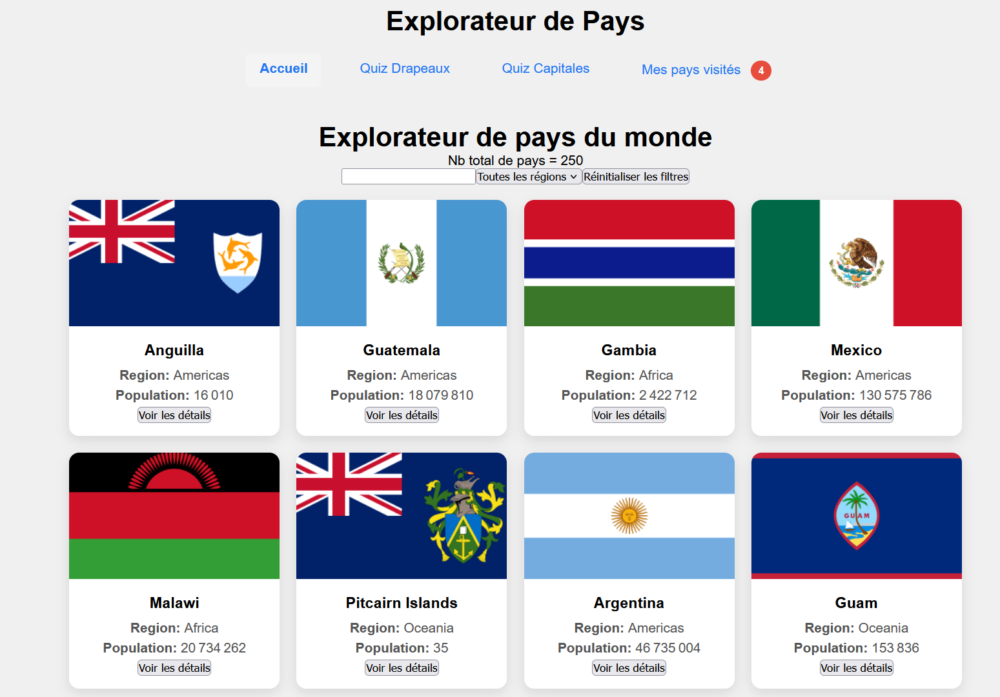
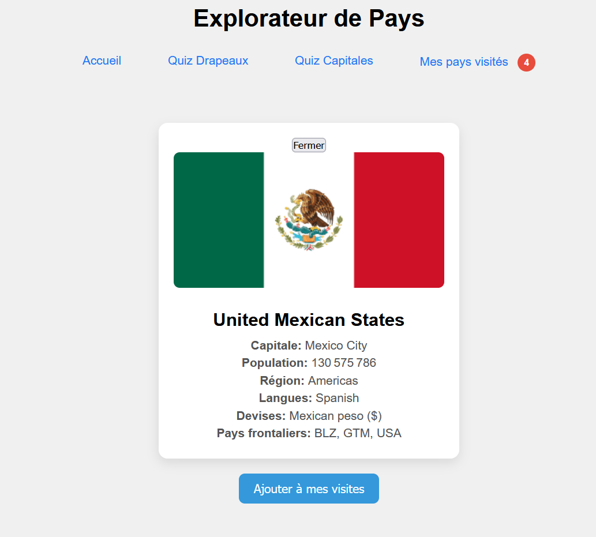
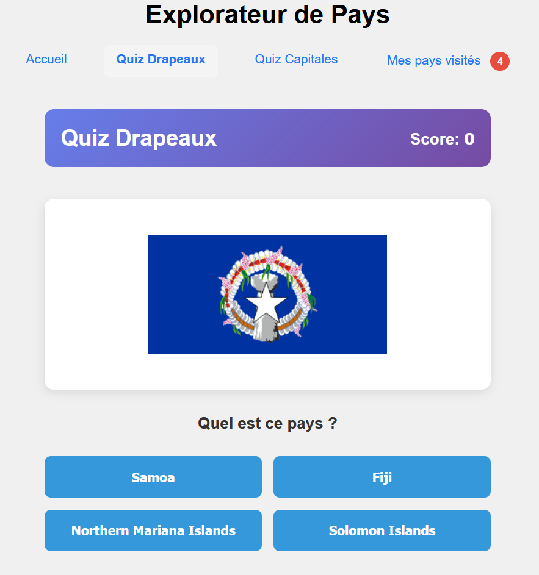
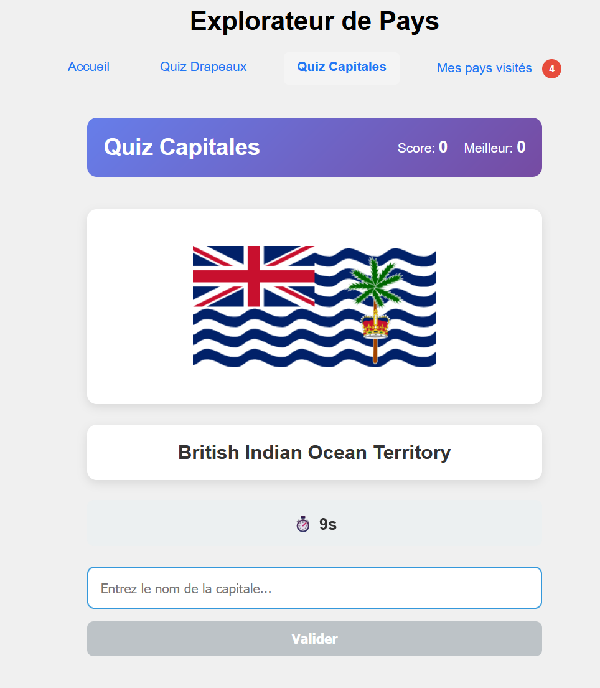
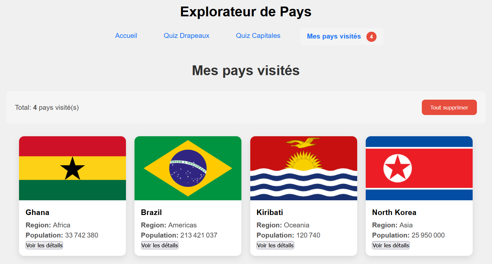

# Country Explorer & Quiz

Une application web interactive développée avec **Vue.js 3** permettant d'explorer les pays du monde, de suivre ses voyages et de tester ses connaissances géographiques.

## Fonctionnalités Principales

### Exploration et Recherche
* **Affichage dynamique** : Liste complète des pays du monde récupérée via l'API RestCountries avec affichage du drapeau, nom, population et région.
* **Filtrage multicritère** : 
  - Recherche par nom de pays (en temps réel)
  - Filtrage par zone géographique (Afrique, Amériques, Asie, Europe, Océanie)
  - Combinaison des deux filtres pour affiner vos résultats
* **Fiche détaillée** : Vue complète de chaque pays incluant :
  - Drapeau et informations générales
  - Capitale(s) et code ISO
  - Population et superficie
  - Langues parlées
  - Devises utilisées
  - Pays frontaliers

### Modules de Quiz Interactifs

#### Quiz Drapeaux
* Identifier le bon pays parmi 4 propositions
* Les propositions sont basées sur la même région pour augmenter la difficulté progressive
* Système de score en temps réel
* Retour immédiat (correct/incorrect)

#### Quiz Capitales
* Saisir le nom de la capitale du pays affiché
* Validation automatique de la réponse
* Système de score dynamique
* Suivi du "Meilleur Score" (Best Score)
* Questions aléatoires pour chaque session

### Carnet de Voyage (Visited)
* **Gestion des visites** : Ajouter ou retirer des pays de votre liste personnelle de voyages
* **Sauvegarde persistante** : Utilisation du `localStorage` pour conserver vos pays visités et vos scores même après avoir fermé le navigateur
* **Statistiques** : Visualisez le nombre de pays visités et votre progression

---

## Captures d'écran

### Page d'accueil - Exploration des pays

*Explorez la liste complète des pays avec filtrage par région et recherche par nom*

### Détail d'un pays

*Consultez toutes les informations d'un pays : capitale, devises, langues, pays voisins*

### Quiz Drapeaux

*Testez vos connaissances : identifiez le pays à partir de son drapeau parmi 4 options*

### Quiz Capitales

*Saisissez la capitale et gagnez des points ! Votre meilleur score est enregistré*

### Carnet de Voyage

*Consultez vos pays visités et vos statistiques de voyage*

---

## Stack Technique

* **Framework** : [Vue.js 3](https://vuejs.org/) (Utilisation de la Composition API et des Composables).
* **Routing** : [Vue Router](https://router.vuejs.org/) pour la navigation entre les pages.
* **API** : [RestCountries V3.1](https://restcountries.com/).
* **Build Tool** : Vite.

---

## Structure du Code

* **`src/components/`** : Composants d'interface comme `CountryCard`, `SearchBar` et `RegionFilter`.
* **`src/composable/`** : Logique métier partagée (`useFetch` pour les appels API, `useVisited` pour le stockage, `useCapitalQuiz` pour la logique du jeu).
* **`src/pages/`** : Vues principales de l'application (`HomePage`, `FlagQuizPage`, `VisitedPage`).

---

## Installation

1. **Cloner le projet** :
  ```sh
  git clone https://github.com/m-degroux/CountryQuiz.git
  ```
2. **Installer les dépendances** :
  ```sh
  npm install
  ```
3. **Lancer le serveur de développement** :
  ```sh
  npm run dev
  ```
